# Mermaid-Android

Pure Kotlin Mermaid diagram renderer — no JavaScript, no WebView, no external dependencies.

Parses [Mermaid](https://mermaid.js.org/) diagram syntax and renders to `Bitmap` using Android Canvas.

> **See also**: [Mermaid-iOS](https://github.com/hggz/Mermaid-iOS) — the Swift companion library with feature parity.

## Features

- **Zero dependencies** — pure Kotlin + Android Canvas, no third-party libraries needed
- **No WebView** — renders natively, works in background threads and services
- **7 diagram types**: Flowcharts, Sequence Diagrams, Pie Charts, Class Diagrams, State Diagrams, Gantt Charts, ER Diagrams
- **Flowcharts**: 7 node shapes, 4 edge styles, edge labels, all 5 directions, subgraph support
- **Class diagrams**: Classes with properties/methods, visibility modifiers, 6 relationship types, annotations
- **State diagrams**: States, transitions, start/end markers, labels, descriptions
- **Gantt charts**: Sections, tasks with statuses (done/active/critical), date formatting
- **ER diagrams**: Entities with typed attributes (PK/FK/UK keys), crow's foot notation, 4 cardinality types
- **Sequence diagrams**: Participants, actors, 6 message arrow styles, lifelines
- **Pie charts**: Titled, decimal values, color-coded slices with legend
- **Style directives**: `classDef`, `class`, `style`, `:::className` for custom node styling
- **Dark mode**: Built-in dark color scheme via `MermaidKotlin.darkMode()`
- **Edge routing**: Liang-Barsky line-rectangle intersection algorithm to route edges around obstacles
- **PNG export**: Render directly to `ByteArray` for saving or sharing

## Supported Diagrams

### Flowcharts

<table>
<tr><th>Mermaid.js (GitHub)</th><th>MermaidKotlin (Native)</th></tr>
<tr>
<td>

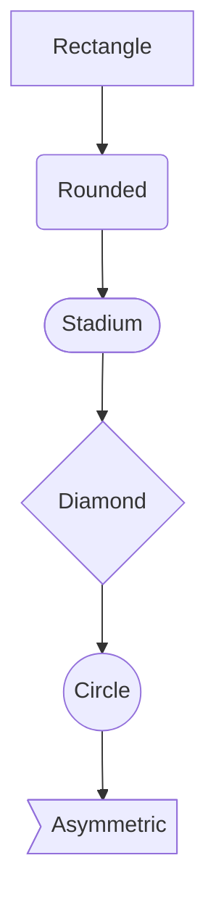

</td>
<td>
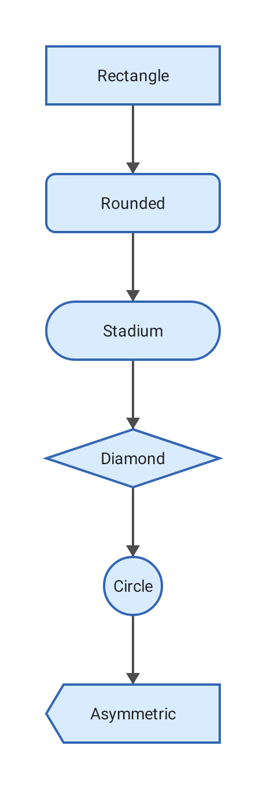
</td>
</tr>
</table>

### Sequence Diagrams

<table>
<tr><th>Mermaid.js (GitHub)</th><th>MermaidKotlin (Native)</th></tr>
<tr>
<td>

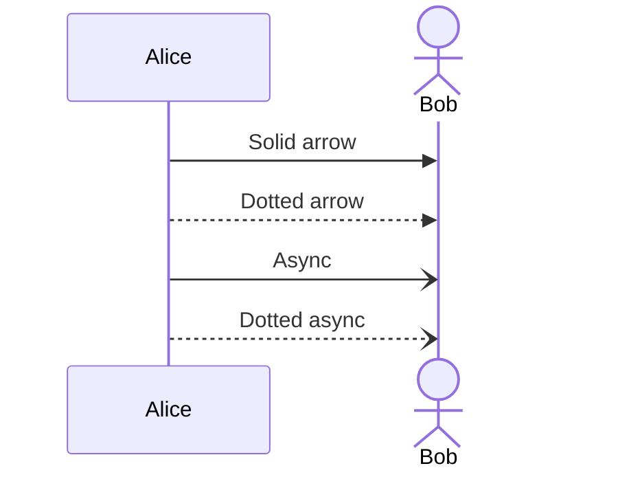

</td>
<td>
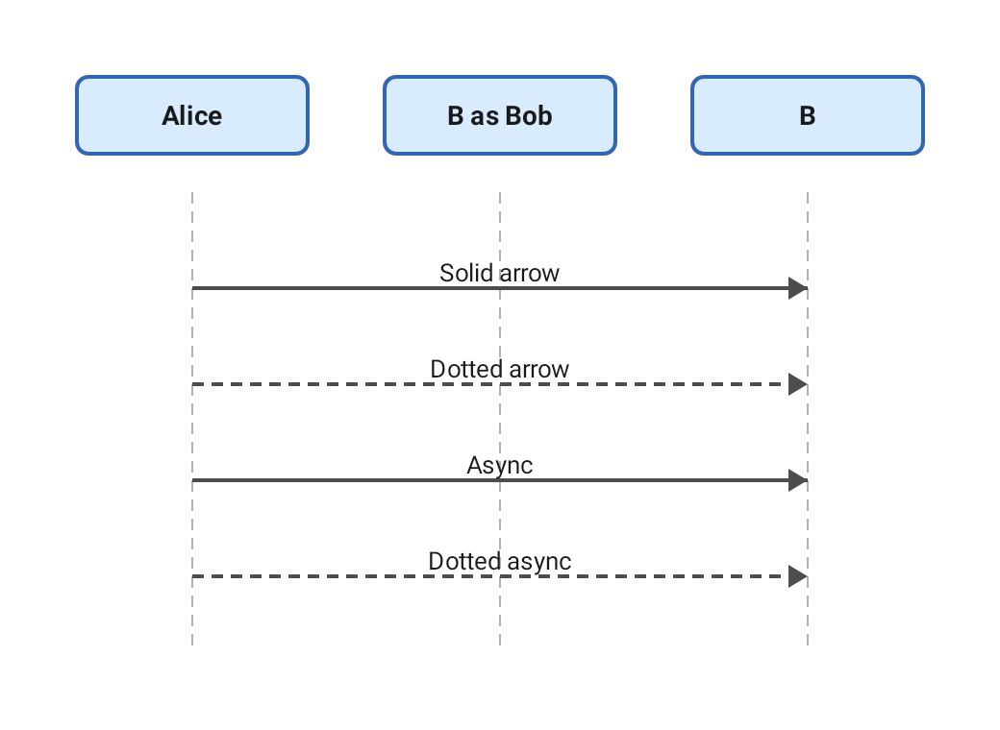
</td>
</tr>
</table>

### Pie Charts

<table>
<tr><th>Mermaid.js (GitHub)</th><th>MermaidKotlin (Native)</th></tr>
<tr>
<td>

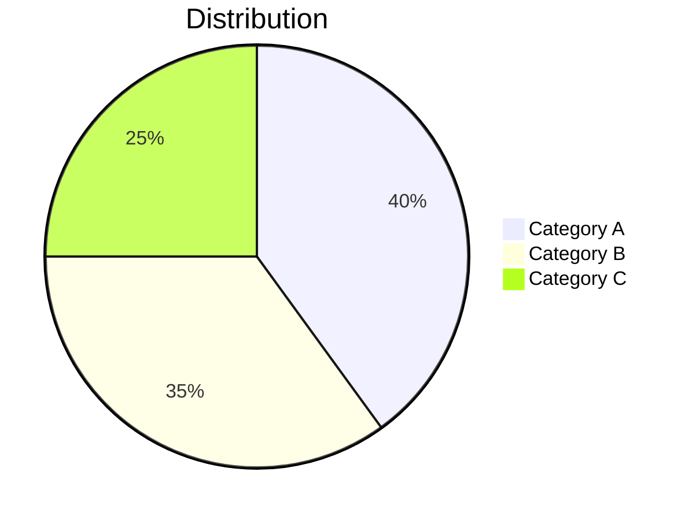

</td>
<td>
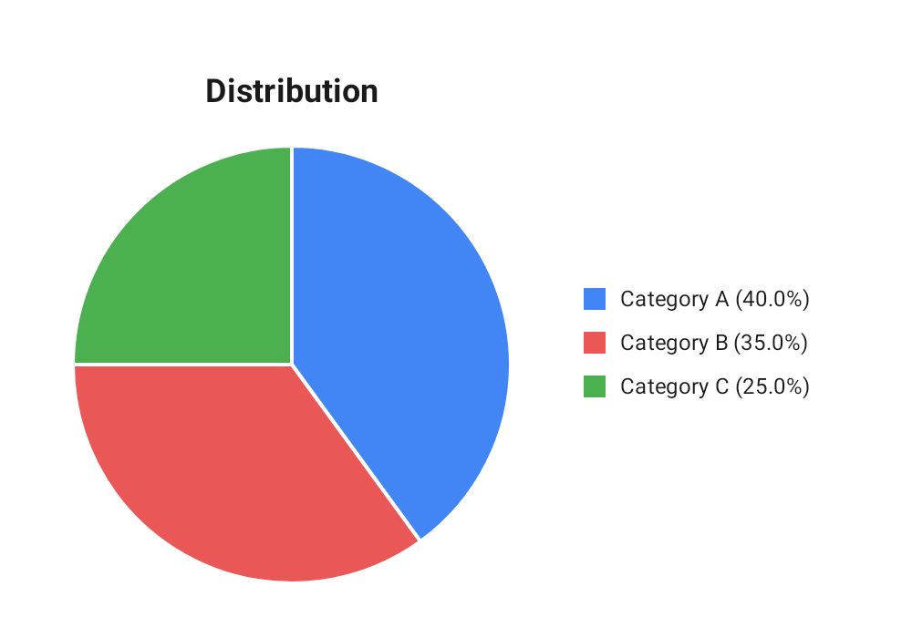
</td>
</tr>
</table>

### Class Diagrams

<table>
<tr><th>Mermaid.js (GitHub)</th><th>MermaidKotlin (Native)</th></tr>
<tr>
<td>

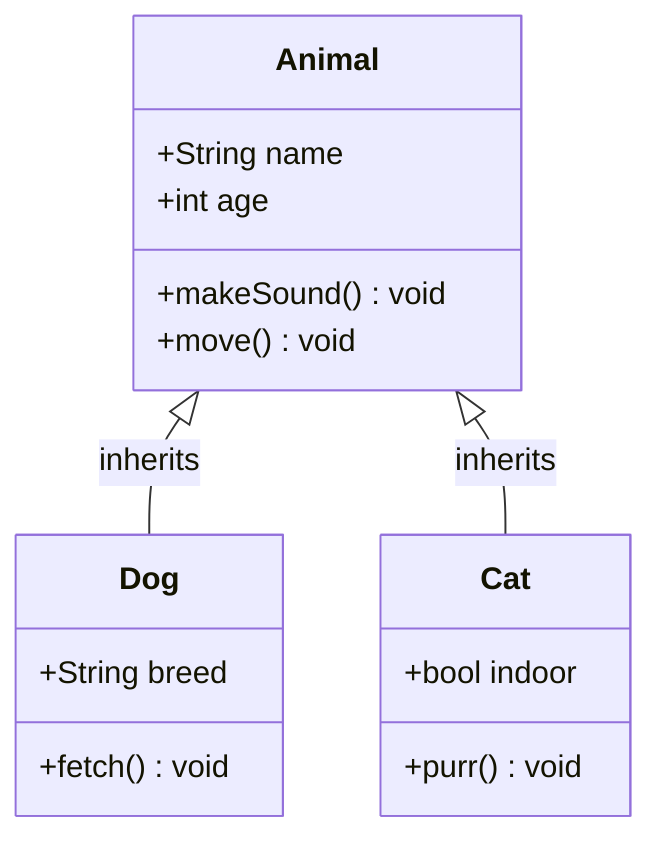

</td>
<td>
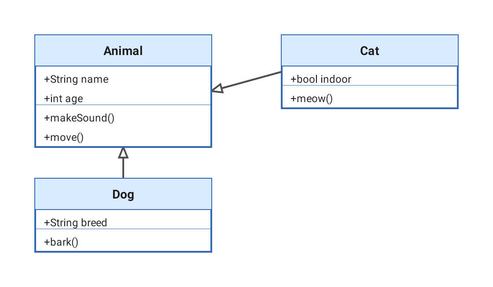
</td>
</tr>
</table>

### State Diagrams

<table>
<tr><th>Mermaid.js (GitHub)</th><th>MermaidKotlin (Native)</th></tr>
<tr>
<td>

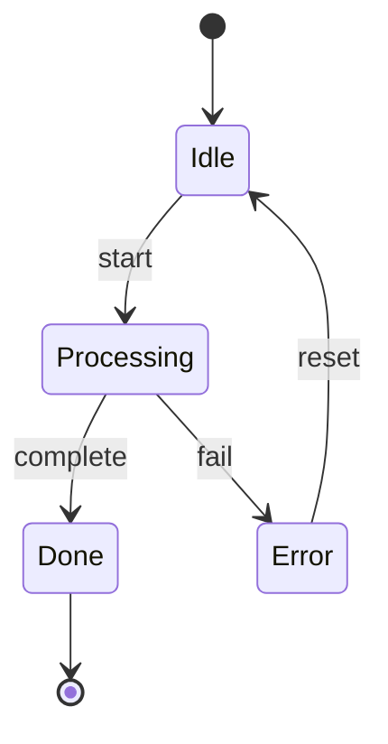

</td>
<td>
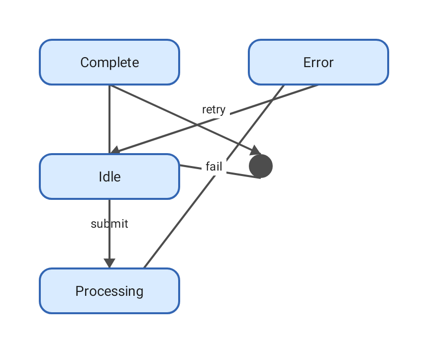
</td>
</tr>
</table>

### Gantt Charts

<table>
<tr><th>Mermaid.js (GitHub)</th><th>MermaidKotlin (Native)</th></tr>
<tr>
<td>

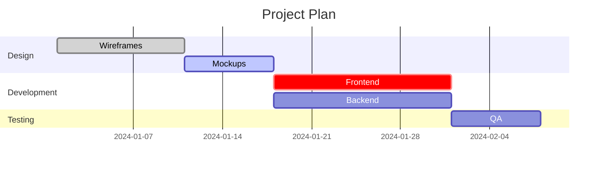

</td>
<td>
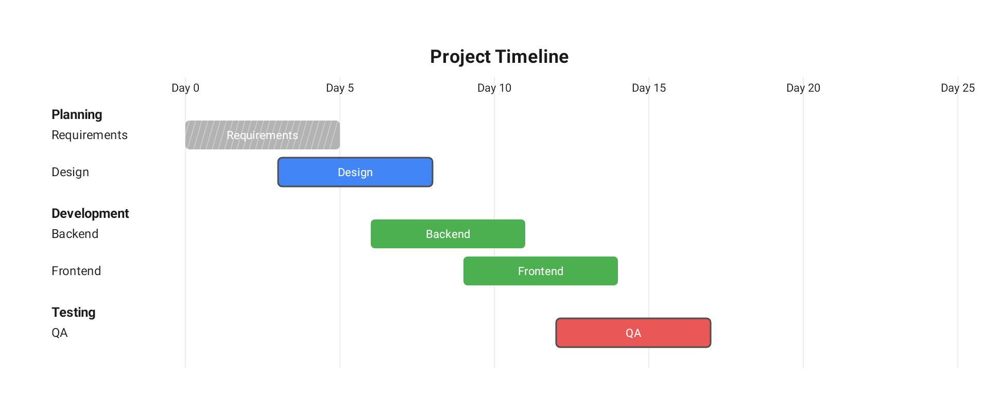
</td>
</tr>
</table>

### ER Diagrams

<table>
<tr><th>Mermaid.js (GitHub)</th><th>MermaidKotlin (Native)</th></tr>
<tr>
<td>

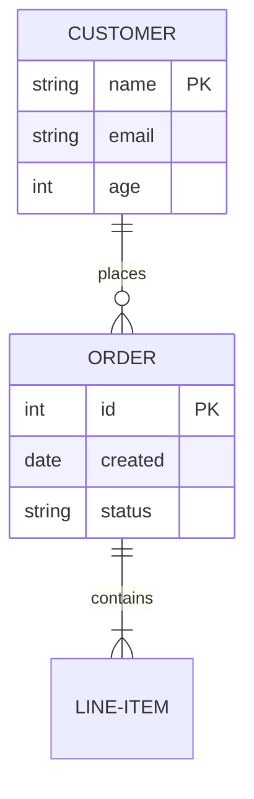

</td>
<td>
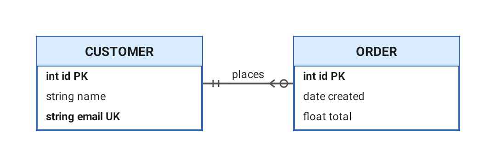
</td>
</tr>
</table>

### Subgraphs

<table>
<tr><th>Mermaid.js (GitHub)</th><th>MermaidKotlin (Native)</th></tr>
<tr>
<td>

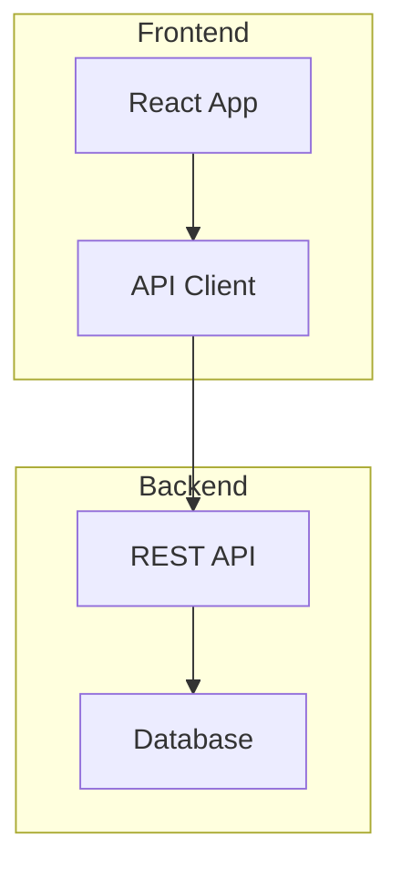

</td>
<td>
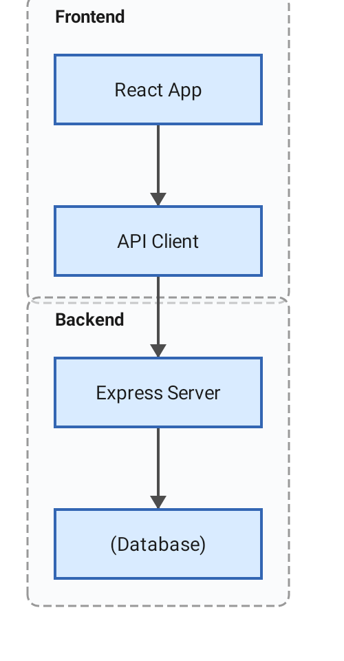
</td>
</tr>
</table>

### Style Directives

<table>
<tr><th>Mermaid.js (GitHub)</th><th>MermaidKotlin (Native)</th></tr>
<tr>
<td>

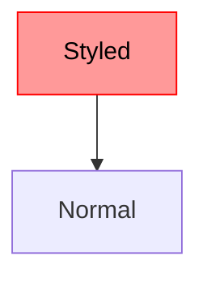

</td>
<td>
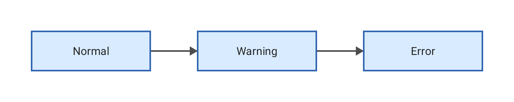
</td>
</tr>
</table>

### Dark Mode

<table>
<tr><th>MermaidKotlin (Native)</th></tr>
<tr>
<td>

</td>
</tr>
</table>

## Installation

### Gradle (Kotlin DSL)

```kotlin
dependencies {
    implementation("com.mermaid:mermaid-kotlin:1.0.0")
}
```

### Local Module

Copy the `mermaidkotlin` module into your project and add to `settings.gradle.kts`:

```kotlin
include(":mermaidkotlin")
```

## Usage

```kotlin
import com.mermaid.kotlin.MermaidKotlin

val mermaid = MermaidKotlin()

// Render to Bitmap
val bitmap = mermaid.render("""
    flowchart TD
        A[Start] --> B{Is valid?}
        B -->|Yes| C[Process]
        B -->|No| D[Reject]
        C --> E[Done]
        D --> E
""".trimIndent())

// Render to PNG bytes
val pngBytes = mermaid.renderToPNG("""
    sequenceDiagram
        Client->>Server: GET /users
        Server->>DB: SELECT * FROM users
        DB-->>Server: ResultSet
        Server-->>Client: 200 OK
""".trimIndent())

// Parse only (no rendering)
val diagram = mermaid.parse("""
    pie title Languages
        "Kotlin" : 45
        "Swift" : 35
        "Python" : 20
""".trimIndent())
```

### Dark Mode

```kotlin
val darkMermaid = MermaidKotlin.darkMode()
val bitmap = darkMermaid.render("flowchart TD\n  A --> B --> C")
```

### Custom Configuration

```kotlin
import com.mermaid.kotlin.layout.LayoutConfig

val config = LayoutConfig(
    nodeWidth = 200f,
    nodeHeight = 80f,
    fontSize = 18f,
    pieRadius = 150f
)

val mermaid = MermaidKotlin(config)
val bitmap = mermaid.render("flowchart TD\n  A[Big Node] --> B[Another]")
```

## Architecture

```
Mermaid DSL String
       │
       ▼
   ┌────────┐
   │ Parser │   Regex-based DSL parsing
   └────┬───┘
        │
        ▼
  ┌──────────┐
  │  Model   │   7 diagram types (Flowchart, Sequence, Pie, Class, State, Gantt, ER)
  └────┬─────┘
       │
       ▼
 ┌──────────┐
 │  Layout  │   Topological sort, position calculation, edge routing
 └────┬─────┘
       │
       ▼
 ┌──────────┐
 │ Renderer │   Android Canvas → Bitmap → PNG
 └──────────┘
```

## Supported Mermaid Syntax

### Flowchart

- **Directions**: `TD`, `TB`, `BT`, `LR`, `RL`
- **Node shapes**: `[rect]`, `(rounded)`, `{diamond}`, `([stadium])`, `((circle))`, `{{hexagon}}`, `>asymmetric]`
- **Edge styles**: `-->` solid, `-.->` dotted, `==>` thick, `~~~` invisible
- **Edge labels**: `-->|label|`
- **Subgraphs**: `subgraph name` / `end` with nested nodes
- **Style directives**: `classDef`, `class`, `style`, `:::className`

### Sequence Diagram

- **Declarations**: `participant`, `actor`, `participant A as Alice`
- **Arrow styles**: `->>`, `-->>`, `->`, `-->`, `-x`, `--x`, `-)`, `--)`
- **Auto-participants**: Created automatically from messages

### Pie Chart

- **Title**: `pie title My Chart` or separate `title` line
- **Slices**: `"Label" : value` (supports decimals)

### Class Diagram

- **Classes**: `class ClassName { }` blocks with members
- **Members**: `+public`, `-private`, `#protected`, `~package` visibility
- **Relationships**: `<|--` inheritance, `*--` composition, `o--` aggregation, `-->` association, `..>` dependency, `--|>` realization
- **Annotations**: `<<interface>>`, `<<abstract>>`, `<<enum>>`

### State Diagram

- **States**: Named states, `[*]` for start/end
- **Transitions**: `State1 --> State2 : label`
- **Descriptions**: `state "Description" as s1`

### Gantt Chart

- **Title**: `title Project Name`
- **Date format**: `dateFormat YYYY-MM-DD`
- **Sections**: `section Name`
- **Tasks**: `Task name : status, id, start, duration`
- **Statuses**: `done`, `active`, `crit`
- **Dependencies**: `after taskId`

### ER Diagram

- **Entities**: `ENTITY { }` blocks with attributes
- **Attributes**: `type name KEY` (PK, FK, UK)
- **Relationships**: `||--o{`, `||--|{`, `}o--o{` etc.
- **Cardinalities**: exactly-one `||`, zero-or-one `|o`, zero-or-more `o{`, one-or-more `|{`

## Requirements

- Android SDK 24+ (minSdk)
- Kotlin 1.9+
- No external dependencies

## Testing

```bash
./gradlew :mermaidkotlin:test
```

56 tests covering all 7 diagram types, parsing, layout, and rendering.

## License

MIT License — see [LICENSE](LICENSE) for details.

## See Also

- [Mermaid-iOS](https://github.com/hggz/Mermaid-iOS) — The Swift counterpart with feature parity
- [Mermaid.js](https://mermaid.js.org/) — The original JavaScript library
