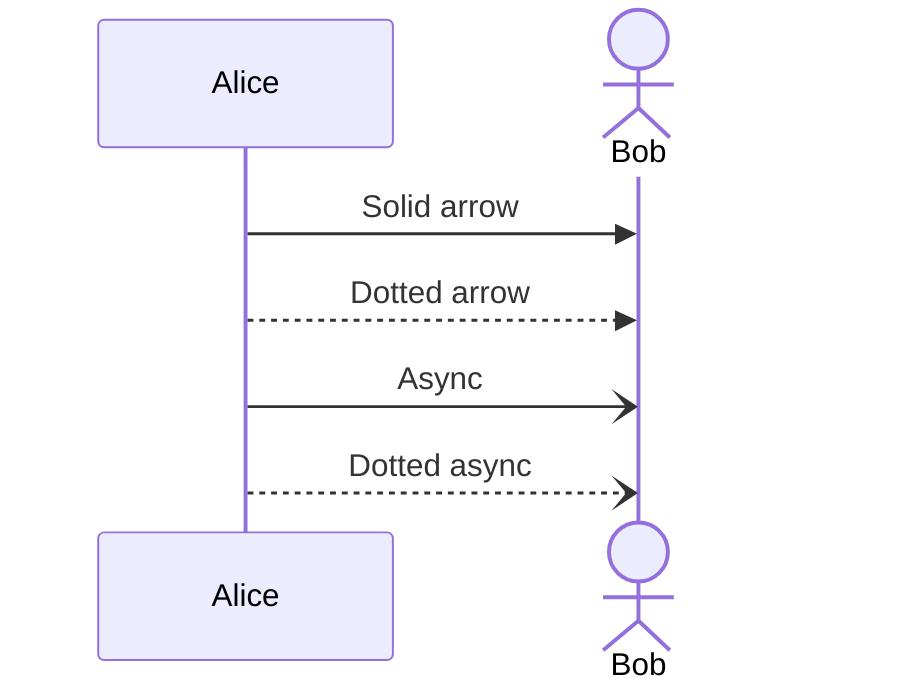
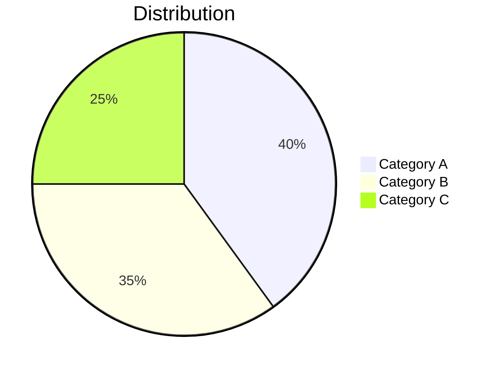

# Mermaid-Android

A pure Kotlin Android library for rendering [Mermaid](https://mermaid.js.org/) diagrams natively using Android Canvas. No WebView, no JavaScript — just native Kotlin and Android graphics.

This is the Android companion to [Mermaid-iOS](https://github.com/hggz/Mermaid-iOS).

## Supported Diagrams

### Flowcharts

<table>
<tr><th>Mermaid.js (GitHub)</th><th>MermaidKotlin (Native)</th></tr>
<tr>
<td>


</td>
<td>

</td>
</tr>
</table>

| Direction | Meaning |
|-----------|---------|
| `TD` / `TB` | Top → Down |
| `BT` | Bottom → Top |
| `LR` | Left → Right |
| `RL` | Right → Left |

| Edge Style | Syntax |
|------------|--------|
| Solid arrow | `-->` |
| Dotted arrow | `-.->` |
| Thick arrow | `==>` |
| Invisible | `~~~` |

### Sequence Diagrams

<table>
<tr><th>Mermaid.js (GitHub)</th><th>MermaidKotlin (Native)</th></tr>
<tr>
<td>



</td>
<td>

</td>
</tr>
</table>

### Pie Charts

<table>
<tr><th>Mermaid.js (GitHub)</th><th>MermaidKotlin (Native)</th></tr>
<tr>
<td>



</td>
<td>

</td>
</tr>
</table>

## Installation

### Gradle (Kotlin DSL)

```kotlin
dependencies {
    implementation("com.mermaid:mermaid-kotlin:1.0.0")
}
```

### Local Module

Copy the `mermaidkotlin` module into your project and add to `settings.gradle.kts`:

```kotlin
include(":mermaidkotlin")
```

## Usage

```kotlin
import com.mermaid.kotlin.MermaidKotlin

val mermaid = MermaidKotlin()

// Render to Bitmap
val bitmap = mermaid.render("""
    flowchart TD
        A[Start] --> B{Is valid?}
        B -->|Yes| C[Process]
        B -->|No| D[Reject]
        C --> E[Done]
        D --> E
""".trimIndent())

// Render to PNG bytes
val pngBytes = mermaid.renderToPNG("""
    sequenceDiagram
        Client->>Server: GET /users
        Server->>DB: SELECT * FROM users
        DB-->>Server: ResultSet
        Server-->>Client: 200 OK
""".trimIndent())

// Parse only (no rendering)
val diagram = mermaid.parse("""
    pie title Languages
        "Kotlin" : 45
        "Swift" : 35
        "Python" : 20
""".trimIndent())
```

### Custom Configuration

```kotlin
import com.mermaid.kotlin.layout.LayoutConfig

val config = LayoutConfig(
    nodeWidth = 200f,
    nodeHeight = 80f,
    fontSize = 18f,
    pieRadius = 150f
)

val mermaid = MermaidKotlin(config)
val bitmap = mermaid.render("flowchart TD\n  A[Big Node] --> B[Another]")
```

## Architecture

```
Mermaid DSL String
       │
       ▼
   ┌────────┐
   │ Parser │   Regex-based DSL parsing
   └────┬───┘
        │
        ▼
  ┌──────────┐
  │  Model   │   Diagram / FlowchartDiagram / SequenceDiagram / PieChartDiagram
  └────┬─────┘
       │
       ▼
 ┌──────────┐
 │  Layout  │   Topological sort, position calculation
 └────┬─────┘
       │
       ▼
 ┌──────────┐
 │ Renderer │   Android Canvas → Bitmap → PNG
 └──────────┘
```

## Supported Mermaid Syntax

### Flowchart

- **Directions**: `TD`, `TB`, `BT`, `LR`, `RL`
- **Node shapes**: `[rect]`, `(rounded)`, `{diamond}`, `([stadium])`, `((circle))`, `{{hexagon}}`, `>asymmetric]`
- **Edge styles**: `-->` solid, `-.->` dotted, `==>` thick, `~~~` invisible
- **Edge labels**: `-->|label|`
- **Keywords**: `flowchart`, `graph`

### Sequence Diagram

- **Declarations**: `participant`, `actor`, `participant A as Alice`
- **Arrow styles**: `->>`, `-->>`, `->`, `-->`, `-x`, `--x`, `-)`, `--)`
- **Auto-participants**: Created automatically from messages

### Pie Chart

- **Title**: `pie title My Chart` or separate `title` line
- **Slices**: `"Label" : value` (supports decimals)

## Requirements

- Android SDK 24+ (minSdk)
- Kotlin 1.9+
- No external dependencies

## License

MIT License — see [LICENSE](LICENSE) for details.

## See Also

- [Mermaid-iOS](https://github.com/hggz/Mermaid-iOS) — The iOS/Swift counterpart
- [Mermaid.js](https://mermaid.js.org/) — The original JavaScript library
